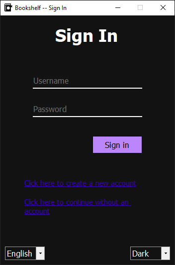
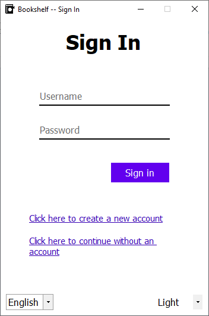
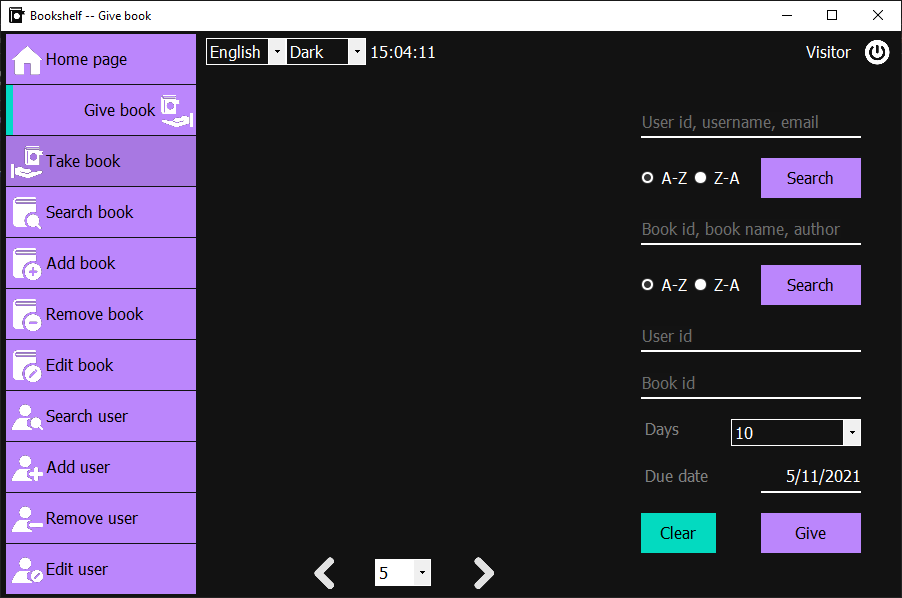
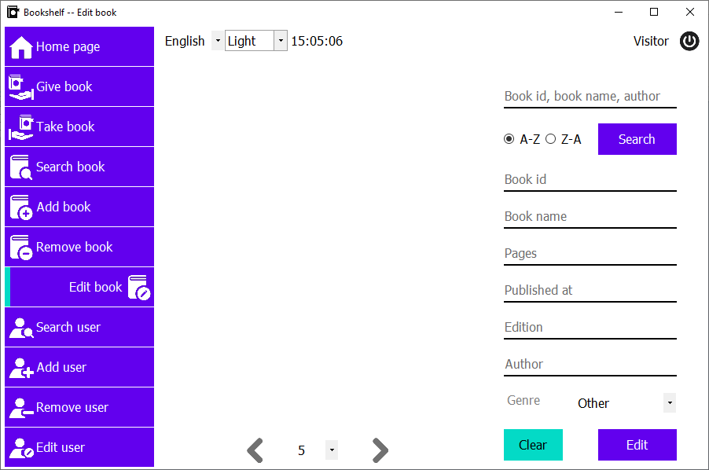

# Bookshelf_WinForms






## Start

Look at .env.example, docker-compose.yml and Properties/Settings.settings files

[MSSQL Server](https://hub.docker.com/_/microsoft-mssql-server)

```sh
docker run -e 'ACCEPT_EULA=Y' -e 'SA_PASSWORD=yourStrong(!)Password' -e 'MSSQL_PID=Express' -p 1433:1433 -d -v <YOUR_PATH>:/var/opt/mssql/data --name MsSqlServer mcr.microsoft.com/mssql/server:2017-latest-ubuntu
```

```sh
docker exec -it <container_id|container_name> /opt/mssql-tools/bin/sqlcmd -S localhost -U sa -P <your_password>
```

## Data Visualization

<https://github.com/dotnet/winforms-datavisualization>
<https://www.nuget.org/packages/System.Windows.Forms.DataVisualization/>
